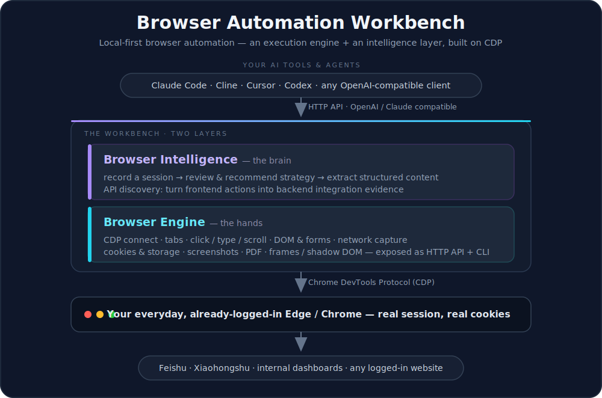
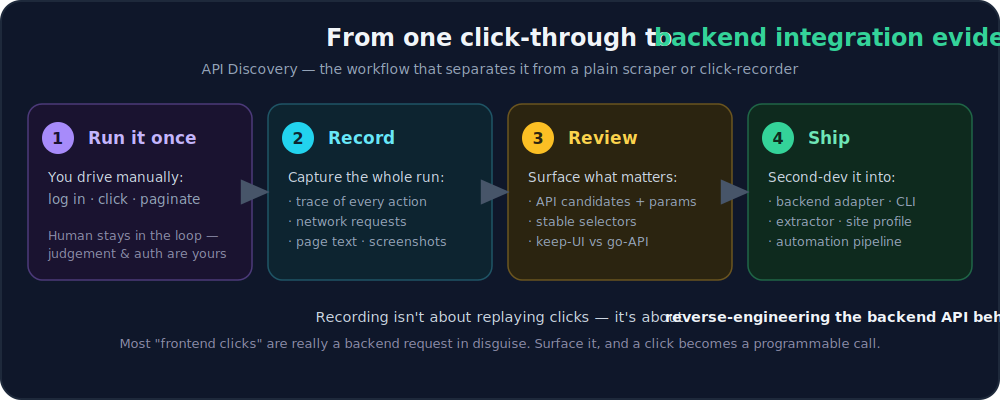
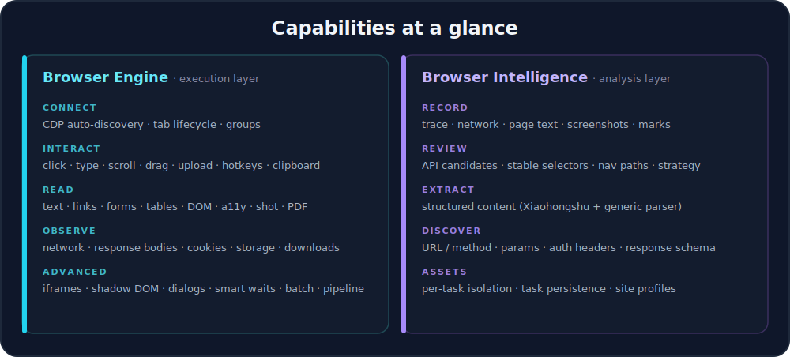

<div align="center">

# 🧭 Browser Automation Workbench

**本地优先的浏览器自动化工作台 —— 一个执行引擎 + 一个智能分析层，构建于 CDP 之上。**

*Local-first browser automation: an execution engine + an intelligence layer, built on the Chrome DevTools Protocol.*

[](package.json)
[](https://chromedevtools.github.io/devtools-protocol/)
[](packages/browser-intelligence)
[](CONTRIBUTING.md)
[](https://github.com/cheer932041235/browser-automation-workbench/stargazers)

<br/>



</div>

<br/>

## 它是什么

Browser Automation Workbench 把「真实浏览器的能力」沉淀成一套**可复用、可积累**的操作、分析与内容提取流程。

它**不是**一次性爬虫，也**不是**无人值守的监控系统，而是一个面向**人机协同**的工作台：**你在场负责登录、判断和决策，工具负责执行、记录、复盘和结构化输出。** 它直接接管你日常在用、**已经登录好**的 Edge / Chrome —— 没有 API 的网站、登录之后才能看的内容、靠 JS 动态渲染的页面，都能拿下。

> 一句话：**把「操控浏览器」从一堆用完即弃的脚本，变成一套能沉淀资产的能力。**

<br/>

## ✨ 为什么不一样

| | |
|---|---|
| 🔌 **接管你已登录的浏览器** | 通过 CDP 连接你日常的 Edge / Chrome，**天然带着登录态**（Cookie、会话都在）——不用交密码、不用重新过验证码。 |
| 🧠 **执行 + 分析，双层设计** | 「手脚」（Browser Engine）只管动，「大脑」（Browser Intelligence）负责录制、复盘、提取——分层才能复用与扩展。 |
| 🔍 **API Discovery（灵魂功能）** | 录制的终点不是「复刻鼠标点击」，而是**把一次前端操作逆向成后端接口证据**，直接喂给二次开发。 |
| 🏠 **本地优先 & 人在回路** | 默认连本机、输出只写本地；登录 / 验证码 / 风控**绝不做无人值守绕过**——安全边界写死在设计里。 |

<br/>

## 🏗️ 两层架构

上方总览图已经把全貌画出来了，这里补充分工：

- **Browser Engine —— 执行层（手脚）**
  通过 **Chrome DevTools Protocol (CDP)** 连接你日常的浏览器实例，把点击、输入、截图、网络监控、Cookie / Storage、DOM 抓取、任务持久化等底层能力，**封装成本地 HTTP API 和简短 CLI**。它只负责「动」，不判断内容该不该要。

- **Browser Intelligence —— 分析层（大脑）**
  以 Engine 为执行后端，把一次浏览过程转成**可复盘、可提取、可复用**的任务资产：`record`（录制）→ `review`（识别接口 / 选择器 / 策略）→ `extract`（结构化提取）。它只负责「想」，不重复造底层轮子。

<br/>

## 🔍 API Discovery —— 灵魂功能

很多「前端点击」，本质上是在触发一个后端接口。**录制的目的不该停留在复刻鼠标动作，而是把这条操作路径变成「后端接口的证据」** —— URL / method、参数、认证 headers、返回结构，以及最关键的判断：**哪些步骤必须保留界面，哪些可以直接变成一行 API 调用。**

<div align="center">

</div>

<br/>

## 🧰 能力一览

<div align="center">

</div>

<br/>

## 🚀 快速开始

**前置条件**

- Node.js **22+**
- Edge 或 Chrome，并**开启远程调试**

**① 让浏览器带上调试端口**

在 Edge 地址栏打开 `edge://inspect/#remote-debugging`，勾选 **Allow remote debugging for this browser instance**；或直接带参数启动：

```powershell
& "C:\Program Files (x86)\Microsoft\Edge\Application\msedge.exe" --remote-debugging-port=9222
```

**② 启动执行引擎**

```bash
npm install
npm run engine:start
```

**③ 确认就绪**

```bash
npm run bi -- health      # 或：curl http://localhost:3456/health
```

返回 `connected: true` 即代表引擎已连上你的浏览器。

<br/>

## 💻 用法示例

**直接操作浏览器（Browser Engine CLI）**

```bash
npm run engine:cli -- tabs                                 # 列出所有标签页
npm run engine:cli -- new https://example.com             # 新开一个标签
npm run engine:cli -- text <targetId>                     # 抓取页面正文
npm run engine:cli -- shot <targetId> screenshots/a.png   # 截图
npm run engine:cli -- close <targetId>                    # 关闭标签
```

**录制 → 复盘 → 提取（Browser Intelligence）**

```bash
npm run bi -- record start demo --url https://example.com
npm run bi -- record mark "关键页面已打开"
npm run bi -- record stop
npm run bi -- review demo      # 识别 API 候选、稳定选择器、自动化策略
npm run bi -- extract demo     # 从 trace 提取结构化内容
```

<br/>

## 🧭 接入你的 AI 工具

Engine 对外就是一个标准的 HTTP API，可被任何 Agent / 编辑器 / 脚本调用。它也提供 CLI 与 HTTP 双入口（`npm run engine:cli -- help` 查看全部命令，`GET /help` 查看全部路由），覆盖标签管理、交互、页面分析、网络观察、Cookie/Storage、剪贴板、iframe / Shadow DOM 等能力。

<br/>

## 📂 项目结构

```text
browser-automation-workbench/
├── docs/                       # 架构、上手、安全、路线图等文档
├── packages/
│   ├── browser-engine/         # 执行层：CDP 连接、HTTP API、CLI
│   └── browser-intelligence/   # 分析层：recorder / reviewer / extractor
├── examples/                   # 端到端示例（页面巡检、录制复盘、站点 profile）
└── scripts/
```

<br/>

## 📐 设计原则

- **本地优先** —— 默认连接本机浏览器，产物写本地 `logs/`，不外传。
- **人在回路** —— 不把账号登录、验证码、风控绕过做成无人值守自动化。
- **最小侵入** —— 新建并管理自己的标签页，尽量不干扰你已有的页面。
- **可复盘** —— 每次重要浏览都能生成 trace、review、extract。
- **面向二次开发** —— 录制结果用于发现接口与业务状态，不承诺一键生成生产级集成。
- **可扩展** —— 新增站点 profile、任务模板、extractor、pipeline，而不必重写底层 CDP。

## 🔒 安全边界

- 不绕过验证码、登录风控或账号安全机制。
- 不提交 `logs/`、截图、Cookie、Token、storage dump（已在 `.gitignore` 中忽略）。
- 对**发送、购买、删除、改配置**等不可逆操作，先让用户确认。
- 默认只操作自己新建的标签，不动用户已有 tab。

<br/>

## 🗺️ 状态与路线图

- **Browser Engine**：可用的执行层，HTTP API + CLI 完整。
- **Browser Intelligence**：v0.3.0，Recorder / Reviewer / Extractor 完成，**76 tests passing**。
- **近期计划**：Engine 自动化测试与 CI、从 `API_HELP` 生成接口文档、trace 本地可视化查看器、extractor 插件化。详见 [`docs/roadmap.md`](docs/roadmap.md)。

<br/>

## 🤝 参与 & 📄 许可

欢迎 Issue 与 PR —— 详见 [`CONTRIBUTING.md`](CONTRIBUTING.md) 与 [`SECURITY.md`](SECURITY.md)。

> 📌 开源许可证即将补充（License TBD）。在正式添加之前，若你想复用本仓库代码，请先开 Issue 与作者沟通。

<div align="center">
<br/>
<sub>Built for humans who stay in the loop. 🧭</sub>
</div>
